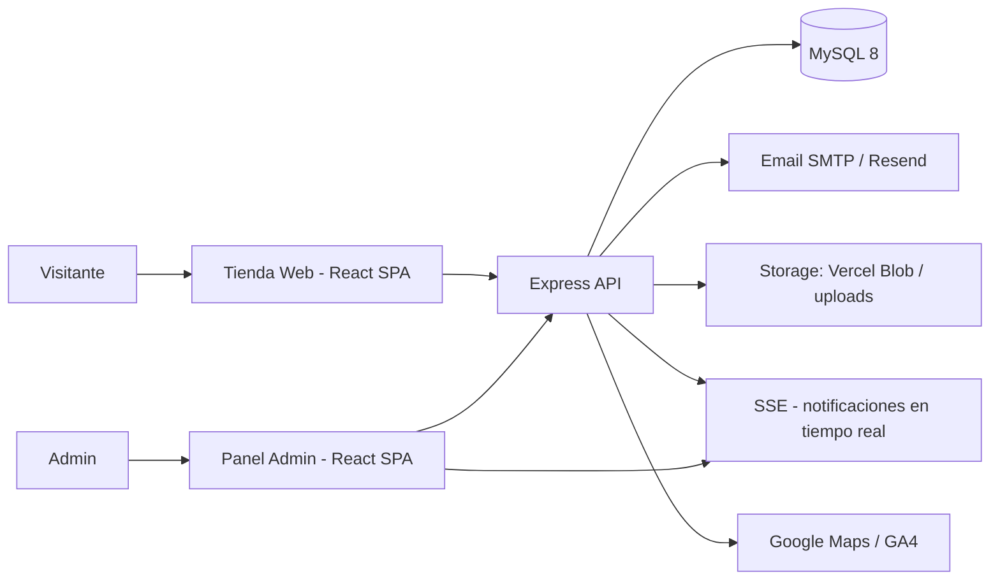

<!--
  ╔══════════════════════════════════════════════════════════════════╗
  ║  MAISON ROSAS · webhermanos                                      ║
  ║  E-commerce full-stack para una pastelería peruana               ║
  ║  Mantenimiento: edita README.md y assets/ cuando cambie el repo  ║
  ╚══════════════════════════════════════════════════════════════════╝
-->

<!-- ================= HERO ================= -->
<p align="center">
  
</p>

<div align="center">
  

  

  <p>
    <b>Kekes artesanales peruanos</b> — Tienda online + panel administrativo full-stack
    para la pastelería familiar <b>Rosas Albines</b>.
  </p>

  <p>
    <a href="https://webhermanos-client.vercel.app"></a>
    <a href="CHANGELOG.md"></a>
    <a href="docker/README.md"></a>
  </p>

  <p>
    <font color="#C9A98F" size="2">🟢 En producción (Vercel) · Versión 1.1.0 · Licencia MIT</font>
  </p>
</div>

<!-- ================= QUÉ ES ================= -->
## 📖 ¿Qué es Maison Rosas?

Una **aplicación web completa** para una pastelería familiar real: los clientes exploran un catálogo de **kekes artesanales** con sabores peruanos (chocolate, lúcuma, maracuyá, plátano, zanahoria, naranja, canela y vainilla), hacen pedidos con seguimiento por código, y el equipo administra todo — pedidos, stock de cocina, galería, reseñas y la configuración de la tienda — desde un panel de administración con roles y seguridad reforzada.

- **Para quién:** pastelerías y negocios de repostería que quieren digitalizar sus pedidos sin depender de redes sociales.
- **Problema que resuelve:** reemplaza el flujo manual (mensajes sueltos, hojas de cálculo) por un sistema con pedidos trazables, notificaciones por correo y un panel de gestión en tiempo real.
- **Qué lo diferencia:** arquitectura completa (cliente + API + base de datos + Docker + despliegue), panel multi-rol con seguridad por ruta secreta, IP/MAC y sesiones, y modo offline PWA para la tienda.
- **Objetivo:** servir como producto real en producción y como portafolio que demuestra desarrollo full-stack de punta a punta.

<table>
  <tr>
    <td bgcolor="#1F1410" align="center" width="33%">
      <b><font color="#FBF3E2">🏪 Tienda pública</font></b><br/>
      <font color="#C9A98F" size="2">Catálogo, personalizador con precio validado en servidor, pedidos con OTP, PWA offline y SEO completo.</font>
    </td>
    <td bgcolor="#1F1410" align="center" width="33%">
      <b><font color="#FBF3E2">🔐 Panel admin</font></b><br/>
      <font color="#C9A98F" size="2">Roles (admin, analista, stock), dashboard con gráficos, pedidos y cocina con notificaciones en tiempo real (SSE).</font>
    </td>
    <td bgcolor="#1F1410" align="center" width="33%">
      <b><font color="#FBF3E2">🛡️ Seguridad</font></b><br/>
      <font color="#C9A98F" size="2">Ruta secreta, rate limiting, headers de hardening, anti-SSRF y precios siempre calculados en el servidor.</font>
    </td>
  </tr>
</table>

<!-- ================= DEMO ================= -->
## 🚀 Demo en vivo

| Interfaz | URL | Descripción |
|---|---|---|
| 🏠 **Tienda** | [webhermanos-client.vercel.app](https://webhermanos-client.vercel.app) | Catálogo de kekes, personalizador, pedidos y tracking |
| ❤️ **API Health** | [webhermanos-client.vercel.app/api/health](https://webhermanos-client.vercel.app/api/health) | Estado del servidor (`{"status":"ok"}`) |
| 🔐 **Panel admin** | Ruta secreta configurada con `ADMIN_SECRET_PATH` | No publicada por seguridad |

> El panel admin se sirve en una ruta aleatoria (definida por `ADMIN_SECRET_PATH`) y está protegido además por contraseña, token de sesión y, opcionalmente, filtros de IP/MAC.

<!-- ================= CAPTURAS ================= -->
## 🖼️ Capturas reales


> Capturas generadas automáticamente desde la web desplegada. Para regenerarlas:
> `node scripts/capture-screenshots.mjs` (ver [screenshots/README.md](screenshots/README.md)).

## 🎬 Demo en video

Próximamente: video de la web en acción. Para añadirlo, sube la grabación a
YouTube/Loom y pega el enlace aquí, o guarda un `.mp4` en `media/` (ver
[screenshots/README.md](screenshots/README.md)):

```markdown
[▶️ Ver video demo](https://www.youtube.com/watch?v=TU_ID)
```

<!-- ================= IDENTIDAD ================= -->
## 🎨 Identidad y diseño

Rediseño visual aplicado sobre la web existente (sin tocar arquitectura ni funcionalidad), con dirección **editorial premium**:

- **Paleta "Cacao & Maracuyá"** (color world de una pastelería peruana, dos acentos vivos con oficio): cacao profundo `#2B1A12`, crema mantecosa `#FBF3E2`, **guinda** `#C7442E` solo para CTAs/acciones y **dorado maracuyá** `#E9A13B` para destacados, estrellas y precios.
- **Tipografía**: Playfair Display (títulos serif editoriales) + Plus Jakarta Sans (cuerpo) — máximo 2 familias.
- **Hero editorial**: portada tipo revista con el keke como protagonista, CTAs **Ver Kekes** y **Pedir Ahora** (WhatsApp).
- **Ticker de sabores**: banda en chocolate profundo con los sabores desfilando en loop (marquee CSS, pausa al hover).
- **El Keke de la Casa**: sección destacada con composición editorial asimétrica y datos reales del producto (foto, precio, descripción).
- **Cards de producto**: fotografía protagonista con zoom al hover, precio en caramelo, elevación suave y CTA claro.
- Microinteracciones sutiles reutilizando `animations.css`, textura de grano casi imperceptible, mobile-first y modo oscuro.

<!-- ================= TECH STACK ================= -->
## 🧰 Tech Stack

<p>
  <b>Frontend</b> — <br/>
  <b>Backend</b> — <br/>
  <b>Database</b> —  <code>MySQL 8</code><br/>
  <b>DevOps</b> — 
</p>

### Frontend
- **React 19** + **TypeScript 5** + **Vite 6**
- **Tailwind CSS 4** (con `@tailwindcss/vite`)
- **Motion** (animaciones), **Recharts** (gráficos del panel), **Embla Carousel**
- **Google Fonts**: Playfair Display + Plus Jakarta Sans (máximo 2 familias)
- **lucide-react** (iconos), **sonner** (toasts), **jsbarcode** (códigos de barras), **html2canvas** (capturas)
- **PWA**: Service Worker con modo offline y caché de imágenes en IndexedDB

### Backend
- **Node.js 20+** + **Express 4** + **TypeScript** (bundle con esbuild, dev con tsx)
- **mysql2** (pool de conexiones con health check), **bcryptjs** (hashing), **multer** (uploads)
- **Nodemailer** (SMTP Gmail) y **Resend** (correos transaccionales)
- **express-rate-limit**, **winston** (logging estructurado), **@vercel/blob** (storage serverless), **SSE** (tiempo real)

### Base de datos
- **MySQL 8** (utf8mb4) con **migraciones SQL versionadas** (6 migraciones, 13+ tablas)

### DevOps
- **Docker** multi-stage + **docker-compose** (app + MySQL + Adminer opcional)
- **Vercel** (frontend + funciones serverless) · **HostGator** (guía Apache/.htaccess)
- **GitHub Actions** (CI: typecheck + build)

<!-- ================= ARQUITECTURA ================= -->
## 🏗️ Arquitectura



- **Frontend:** dos SPAs (tienda pública y panel admin) construidas con Vite, servidas como estáticos por Express (o por el CDN de Vercel).
- **Backend:** API REST Express con capas de rutas → servicios → repositorios, y middleware de seguridad (headers, rate limit, validación, auth por token).
- **Base de datos:** MySQL 8, esquema aplicado automáticamente en el primer arranque de Docker (`/docker-entrypoint-initdb.d/`) o vía `npm run db:migrate`.
- **Autenticación:** sesiones de admin con token en BD, un solo dispositivo activo por rol, contraseñas con bcrypt, ruta secreta + filtros opcionales de IP/MAC.
- **Uploads:** almacenamiento local (bind mount en Docker) o Vercel Blob en serverless, con registro en BD y deduplicación por hash.
- **Tiempo real:** SSE para notificaciones de pedidos nuevos y panel de cocina.
- **Deployment:** `docker compose up` para producción autogestionada, o Vercel (estáticos + `api/index.ts` serverless).

<!-- ================= ESTRUCTURA ================= -->
## 📂 Estructura del proyecto

```text
webhermanos/
├── client/                  # Frontend React + Vite (tienda y panel admin)
│   ├── src/apps/web/        #   SPA tienda pública
│   ├── src/apps/admin/      #   SPA panel admin
│   └── src/shared/          #   Componentes, servicios y utilidades compartidos
├── server/                  # API Express + TypeScript
│   └── src/
│       ├── routes/          #   Rutas públicas y de admin
│       ├── services/        #   Lógica de negocio
│       ├── repositories/    #   Capa de datos (MySQL)
│       ├── middleware/      #   Auth, seguridad, rate limit, uploads
│       └── migrations/      #   Esquema SQL versionado
├── api/                     # Entry point serverless para Vercel
├── docker/                  # Guía Docker completa
├── scripts/                 # Utilidades (versionado, seed, uploads)
├── public/                  # Manifest PWA, robots, sitemap
├── docker-compose.yml       # Orquestación (app + MySQL + Adminer)
├── Dockerfile               # Build multi-stage
├── .github/                 # CI y plantillas de issues
└── .env.example             # Plantilla de variables de entorno
```

<!-- ================= FUNCIONALIDADES ================= -->
## ✨ Funcionalidades

### ✅ Implementado

**Tienda pública**
- Catálogo de kekes con búsqueda (tolerante a acentos), filtros por categoría y caché de imágenes.
- Personalizador de kekes (tamaño, relleno, decoración) con **precio calculado y validado en el servidor**.
- Pedidos con código de tracking único, línea de tiempo de estados y **verificación por OTP** (código de 6 dígitos por email).
- Formulario de contacto, galería, reseñas de clientes y sección de preguntas frecuentes.
- Integración WhatsApp, Google Maps y Google Analytics 4 (configurables).
- **PWA con modo offline**: app shell, precarga priorizada e imágenes persistentes en IndexedDB.
- SEO: meta tags, Open Graph, JSON-LD (Schema.org Bakery), sitemap y robots.txt.

**Panel administrativo** (roles: admin, analista, gestor de stock)
- Dashboard con métricas y gráficos (Recharts).
- Gestión de productos, pedidos (estados, vouchers de pago, fotos de progreso) y stock de cocina con **notificaciones en tiempo real (SSE)**.
- Centro de medios unificado: subida de imágenes, hashes, deduplicación y limpieza de huérfanos.
- Galería, reseñas (aprobación y respuestas) y configuración dinámica de toda la tienda.
- Registro de actividad, gestión de contraseñas de roles y envío de credenciales por correo.

**Infraestructura y seguridad**
- API REST con rate limiting por área (API, login, admin, contacto, OTP), timeouts y validación de `Content-Type`.
- Headers de hardening (CSP, HSTS, X-Frame-Options, etc.), cookies `HttpOnly`/`SameSite=Strict`/`__Host-`.
- Anti-SSRF en el proxy de imágenes, sanitización HTML, validación de email RFC-5322 y precios siempre calculados en servidor.
- Docker listo para producción, migraciones idempotentes, logging estructurado con Winston.
- CI con GitHub Actions (typecheck + build) en cada push/PR.

### 🚧 En desarrollo
- Capturas de pantalla oficiales del producto (ver sección Screenshots).
- Decisiones de licencia y roadmap público (se gestionarán vía GitHub Issues).

<!-- ================= INSTALACIÓN ================= -->
## 🛠️ Instalación

### Requisitos
- **Node.js 20+** (para desarrollo local)
- **Docker + Docker Compose** (recomendado, levanta todo) — o **MySQL 8** instalado localmente

### Opción A — Docker (recomendado)

```bash
git clone https://github.com/progamins/webhermanos.git
cd webhermanos
cp .env.example .env      # edita .env con tus claves (ver sección de variables)
docker compose up -d --build
```

| URL | Qué verás |
|---|---|
| http://localhost:3000 | 🏠 Tienda |
| http://localhost:3000/admin | 🔐 Panel admin (redirige a la ruta secreta) |
| http://localhost:3000/api/health | ❤️ Health check |

La primera vez, MySQL tarda ~20-40s en aplicar el esquema automáticamente. Guía completa (backups, troubleshooting, Adminer) en **[docker/README.md](docker/README.md)**.

### Opción B — Desarrollo local

```bash
git clone https://github.com/progamins/webhermanos.git
cd webhermanos
npm install
cp .env.example .env      # DB_HOST=localhost, edita credenciales
npm run db:migrate        # crea el esquema
npm run db:seed           # (opcional) datos de ejemplo
npm run dev               # cliente en :5173 con proxy a la API en :3000
```

### Scripts útiles

| Comando | Descripción |
|---|---|
| `npm run dev` | Desarrollo (cliente + proxy a servidor) |
| `npm run dev:server` | Solo API en modo watch |
| `npm run build` | Build de producción (cliente + servidor) |
| `npm start` | Servidor en producción (sirve el cliente construido) |
| `npm run lint` | Typecheck de ambos workspaces |
| `npm run db:migrate` / `npm run db:seed` | Migraciones / datos de ejemplo |

<!-- ================= VARIABLES ================= -->
## 🔑 Variables de entorno

Copia `.env.example` a `.env` (nunca se sube a GitHub). No se requieren claves para un arranque de prueba, pero la app exige algunos valores para el seed de roles.

### Obligatorias
| Variable | Descripción |
|---|---|
| `DB_HOST` / `DB_PORT` / `DB_USER` / `DB_PASSWORD` / `DB_NAME` | Conexión a MySQL (`db` en Docker, `localhost` en local) |
| `ADMIN_SECRET_PATH` | Ruta aleatoria del panel admin (genera una con `crypto.randomBytes(32).toString('hex')`) |
| `ADMIN_DEFAULT_PASSWORD` / `ANALYST_DEFAULT_PASSWORD` / `STOCK_MANAGER_DEFAULT_PASSWORD` | Contraseñas iniciales de roles (solo para el seed; rotar desde el panel después) |

### Opcionales
| Variable | Descripción |
|---|---|
| `SMTP_USER` / `SMTP_PASS` / `SMTP_HOST` / `SMTP_PORT` | Correo SMTP (Gmail) para notificaciones |
| `RESEND_API_KEY` / `RESEND_SENDER_EMAIL` | Alternativa de correo con Resend |
| `GOOGLE_MAPS_PLATFORM_KEY` | Mapas interactivos |
| `VITE_GA_MEASUREMENT_ID` | Google Analytics 4 |
| `APP_URL` | URL pública del sitio |
| `BLOB_READ_WRITE_TOKEN` | Vercel Blob (solo serverless) |
| `ALLOWED_ADMIN_IPS` / `ALLOWED_MAC_ADDRESSES` | Blindaje extra del panel admin (vacío = sin restricción) |
| `MYSQL_ROOT_PASSWORD` / `DB_PORT_PUBLISHED` / `APP_PORT_PUBLISHED` | Solo Docker |

> 🔒 **Nunca** subas `.env` ni credenciales reales al repositorio. Si tienes secretos en el historial git, rótalos y purga el historial.

<!-- ================= API ================= -->
## 📡 API

Base: `/api`. Respuestas en JSON. El panel admin (`/api/admin/*`) requiere el header `x-admin-token`.

### Públicas
| Método | Endpoint | Propósito |
|---|---|---|
| GET | `/api/health` | Estado del servidor |
| GET | `/api/status` | Diagnóstico (env vars, BD, tablas, auth) |
| GET | `/api/products` | Catálogo de productos |
| GET | `/api/reviews` | Reseñas aprobadas |
| GET | `/api/gallery` | Galería de imágenes |
| GET | `/api/config` | Configuración pública de la tienda |
| GET | `/api/config/critical-urls` | URLs críticas (hero, logo, favicon) |
| GET | `/api/orders?trackingCode=…` o `?email=…` | Consultar pedido por tracking o email |
| POST | `/api/orders` | Crear pedido (precio validado en servidor) |
| POST | `/api/otp/send` | Enviar código OTP (límite: 5/hora) |
| POST | `/api/otp/verify` | Verificar código OTP (límite: 10/15 min) |
| POST | `/api/contact` | Formulario de contacto (límite: 3/hora) |
| POST | `/api/csp-report` | Reportes de violaciones CSP |
| GET | `/api/uploads/:filename` | Servir archivos subidos |
| GET | `/api/image-proxy?url=…` | Proxy de imágenes (anti-SSRF, lista blanca de dominios) |
| GET | `/api/events` | SSE — notificaciones en tiempo real |

### Admin (requieren sesión)
| Método | Endpoint | Propósito |
|---|---|---|
| POST | `/api/admin/login` / `/verify` / `/logout` | Autenticación de roles |
| POST | `/api/admin/change-admin-password` | Cambiar contraseña de admin |
| GET/POST | `/api/admin/products` · `DELETE /api/admin/products/:id` | Gestión de productos |
| GET/POST | `/api/admin/orders` · `POST /orders/status` · `POST /orders/update-full` · `POST /orders/update-payment` | Gestión de pedidos |
| POST | `/api/admin/orders/upload-voucher` · `/delete-voucher` · `/progress-photo` · `/delete-progress-photo` | Vouchers y fotos de progreso |
| POST | `/api/admin/orders/assign-stock` | Asignar stock a pedidos |
| GET/POST | `/api/admin/kitchen/orders` · `/kitchen/update-status` · `/kitchen/notes` | Panel de cocina |
| POST | `/api/admin/orders/reset-timer` | Reiniciar temporizador |
| GET/POST/DELETE | `/api/admin/gallery` | Galería |
| POST | `/api/admin/reviews/approve` · `/reviews/reply` · `DELETE /reviews/:id` | Reseñas |
| GET/POST | `/api/admin/config` | Configuración de la tienda |
| GET/POST/DELETE | `/api/admin/stock` | Stock de pasteles |
| GET/POST | `/api/admin/role-passwords` · `/send-credentials` | Credenciales de roles |
| GET | `/api/admin/activity-log` · `/audit/urls` · `/diagnostics` | Auditoría y diagnóstico |
| GET/DELETE/POST | `/api/admin/storage/*` | Gestión de almacenamiento (listar, borrar, migrar, deduplicar) |
| POST | `/api/upload` | Subida de imágenes (multipart, token requerido) |

<!-- ================= SEGURIDAD ================= -->
## 🔒 Seguridad

Medidas implementadas en el código:

- **Headers de hardening** en todas las respuestas: CSP con `report-uri`, HSTS, `X-Frame-Options`, `X-Content-Type-Options`, `Permissions-Policy`, `Referrer-Policy`, `Cross-Origin-Opener-Policy`.
- **Rate limiting** por IP en API, login, admin, contacto y OTP; timeouts de request y validación de `Content-Type` (anti-CSRF por form-encoding).
- **Panel admin**: ruta secreta (`ADMIN_SECRET_PATH`), filtros opcionales de IP/MAC, sesiones con token, una sesión activa por rol, contraseñas con bcrypt y rotación desde el panel.
- **Anti-SSRF** en el proxy de imágenes (bloqueo de IPs privadas/loopback, lista blanca de dominios, sin seguir redirects).
- **Sanitización HTML** y validación estricta de email en los endpoints públicos.
- **Precios siempre calculados en servidor** (el cliente no decide el total).
- **Cookies** `HttpOnly`, `SameSite=Strict` y `__Host-` en producción.
- **Caché `no-store`** en rutas administrativas; **CORS** restringido por lista de orígenes.

Para reportar una vulnerabilidad, consulta **[SECURITY.md](SECURITY.md)**.

<!-- ================= CONTRIBUIR ================= -->
## 🤝 Contribuir

¿Quieres colaborar? Consulta **[CONTRIBUTING.md](CONTRIBUTING.md)** — incluye cómo reportar bugs, proponer funcionalidades y el flujo de trabajo con ramas.

- Reporta bugs o pide features con las plantillas de **[GitHub Issues](https://github.com/progamins/webhermanos/issues)**.

<!-- ================= LICENCIA ================= -->
## 📄 Licencia

Distribuido bajo la **Licencia MIT** — consulta [LICENSE](LICENSE) para más detalles.

> Permite usar, copiar, modificar y distribuir el código libremente, incluso con fines comerciales, siempre que se conserve el aviso de copyright original. Ideal para un proyecto de portafolio abierto a colaboración.

<!-- ================= DOCUMENTACIÓN ================= -->
## 📚 Documentación adicional

- 🐳 [docker/README.md](docker/README.md) — Guía Docker completa (backups, troubleshooting, Adminer)
- 🌐 [README_DEPLOY_HOSTGATOR.md](README_DEPLOY_HOSTGATOR.md) — Despliegue en HostGator
- 📜 [CHANGELOG.md](CHANGELOG.md) — Historial de versiones
- 🛡️ [SECURITY.md](SECURITY.md) — Política de seguridad

---

<p align="center"><i>Hecho con 💜 y café desde Perú · Progamins</i></p>

<p align="center">
  
</p>
