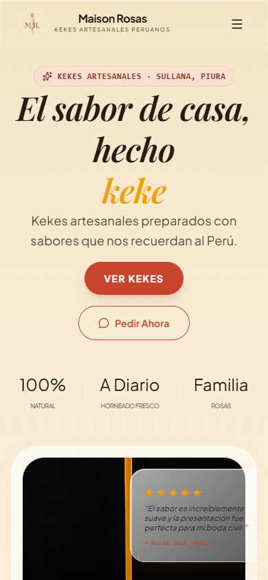
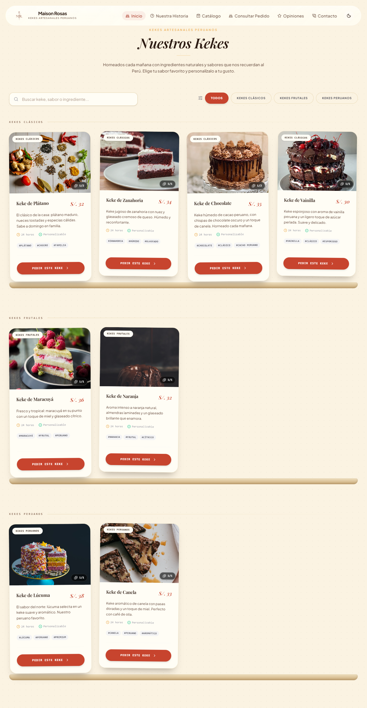
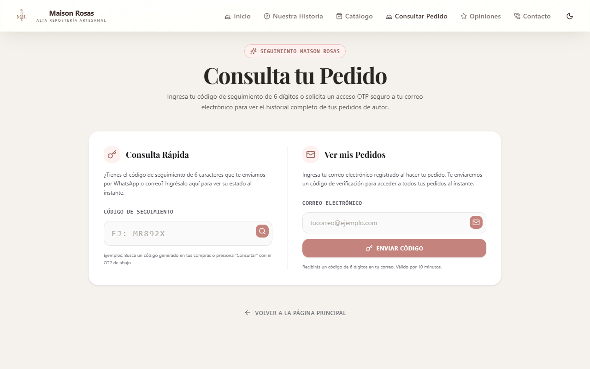
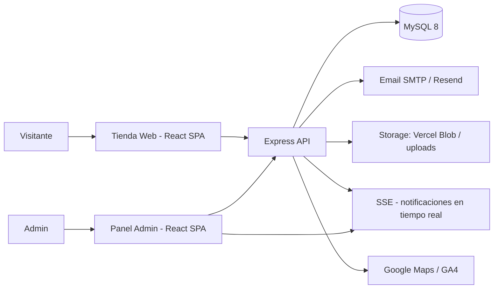

<!--
  ╔══════════════════════════════════════════════════════════════════╗
  ║  MAISON ROSAS · webhermanos                                      ║
  ║  Plataforma full-stack de e-commerce para una pastelería         ║
  ║  React · Node.js · Express · MySQL · Docker · Production ready   ║
  ╚══════════════════════════════════════════════════════════════════╝
-->

<!-- ================= HERO ================= -->
<p align="center">
  
</p>

<div align="center">
  

  

  <p>
    Plataforma <b>full-stack de e-commerce</b> para una pastelería peruana:
    tienda online, pedidos con seguimiento y panel administrativo multi-rol,
    construida con <b>React · Express · MySQL · Docker</b>.
  </p>

  <p>
    <a href="https://webhermanos-client.vercel.app"></a>
    <a href="https://github.com/progamins/webhermanos/issues/new?template=bug_report.md"></a>
    <a href="https://github.com/progamins/webhermanos/issues/new?template=feature_request.md"></a>
  </p>

  <p>
    <font color="#C9A98F" size="2">🟢 En producción · v1.1.0 · MIT License</font>
  </p>
</div>

---

## ✨ Overview

**Maison Rosas** es una aplicación web completa para una pastelería familiar real: los clientes exploran un catálogo de **kekes artesanales** con sabores peruanos, hacen pedidos con seguimiento por código, y el equipo administra todo desde un panel con roles y seguridad reforzada.

- **Problema que resuelve:** reemplaza el flujo manual (mensajes sueltos, hojas de cálculo) por un sistema con pedidos trazables, notificaciones por correo y gestión en tiempo real.
- **Para quién:** pastelerías y negocios de repostería que quieren digitalizar sus pedidos sin depender de redes sociales.
- **Qué lo diferencia:** arquitectura completa (cliente + API + base de datos + Docker + despliegue), panel multi-rol con seguridad por ruta secreta, IP/MAC y sesiones, y modo offline PWA para la tienda.

<table>
  <tr>
    <td bgcolor="#1F1410" align="center" width="33%">
      <b><font color="#FBF3E2">🏪 Tienda pública</font></b><br/>
      <font color="#C9A98F" size="2">Catálogo, personalizador con precio validado en servidor, pedidos con OTP, PWA offline y SEO.</font>
    </td>
    <td bgcolor="#1F1410" align="center" width="33%">
      <b><font color="#FBF3E2">🔐 Panel admin</font></b><br/>
      <font color="#C9A98F" size="2">Roles (admin, analista, stock), dashboard con gráficos, pedidos y cocina con notificaciones en tiempo real (SSE).</font>
    </td>
    <td bgcolor="#1F1410" align="center" width="33%">
      <b><font color="#FBF3E2">🛡️ Seguridad</font></b><br/>
      <font color="#C9A98F" size="2">Ruta secreta, rate limiting, headers de hardening, anti-SSRF y precios siempre calculados en el servidor.</font>
    </td>
  </tr>
</table>

---

## 🎯 Features

| | |
|---|---|
| 🛍️ **Tienda online** | Catálogo de kekes con búsqueda (tolerante a acentos), filtros por categoría y caché de imágenes |
| 🔎 **Personalizador de producto** | Tamaño, relleno y decoración con **precio calculado y validado en el servidor** |
| 📦 **Pedidos con seguimiento** | Código de tracking único, línea de tiempo de estados y verificación por **OTP** (6 dígitos por email) |
| 🔐 **Panel admin multi-rol** | Roles admin, analista y gestor de stock; dashboard con métricas (Recharts) |
| 🚀 **Tiempo real (SSE)** | Notificaciones de pedidos nuevos y panel de cocina en vivo |
| 📱 **PWA offline** | App shell, precarga priorizada e imágenes persistentes en IndexedDB |
| 📧 **Correo integrado** | Nodemailer (Gmail SMTP) y Resend para pedidos, OTP y credenciales |
| 🗄️ **MySQL 8** | Migraciones SQL versionadas (6 migraciones, 13+ tablas), esquema idempotente |
| 🐳 **Docker listo** | Dockerfile multi-stage + docker-compose (app + MySQL + Adminer opcional) |
| ⚡ **CI** | GitHub Actions: typecheck + build en Node 20/22 en cada push/PR |
| 🛡️ **Seguridad** | Ruta secreta, rate limiting por área, headers de hardening, anti-SSRF, cookies `__Host-` |
| 🔍 **SEO** | Meta tags, Open Graph, JSON-LD (Schema.org Bakery), sitemap y robots.txt |

> Todas las características listadas existen en el código actual del repositorio.

---

## 🖼️ Screenshots







> Capturas generadas automáticamente desde la web desplegada. Para regenerarlas: `node scripts/capture-screenshots.mjs` (ver [screenshots/README.md](screenshots/README.md)).

---

## 🧱 Architecture



- **Frontend:** dos SPAs (tienda pública y panel admin) construidas con Vite, servidas como estáticos por Express (o por el CDN de Vercel).
- **Backend:** API REST Express con capas de rutas → servicios → repositorios, y middleware de seguridad (headers, rate limit, validación, auth por token).
- **Base de datos:** MySQL 8, esquema aplicado automáticamente en el primer arranque de Docker o vía `npm run db:migrate`.
- **Autenticación:** sesiones de admin con token en BD, una sesión activa por rol, contraseñas con bcrypt, ruta secreta + filtros opcionales de IP/MAC.
- **Tiempo real:** SSE para notificaciones de pedidos nuevos y panel de cocina.
- **Despliegue:** `docker compose up` para producción autogestionada, o Vercel (estáticos + `api/index.ts` serverless).

---

## 🛠️ Tech Stack

<p>
  <b>Frontend</b> — <br/>
  <b>Backend</b> — <br/>
  <b>Database</b> —  <code>MySQL 8</code><br/>
  <b>Infrastructure</b> — 
</p>

| Categoría | Tecnologías |
|---|---|
| **Frontend** | React 19, TypeScript 5, Vite 6, Tailwind CSS 4, Motion, Recharts, Embla Carousel, lucide-react, sonner |
| **Backend** | Node.js 20+, Express 4, TypeScript (esbuild/tsx), mysql2, bcryptjs, multer, Nodemailer, Resend, winston |
| **Database** | MySQL 8 (utf8mb4) con migraciones SQL versionadas |
| **Infrastructure** | Docker multi-stage, docker-compose, Vercel (serverless), GitHub Actions, HostGator (Apache/.htaccess) |
| **Tools** | PWA (Service Worker + IndexedDB), SSE, jsbarcode, html2canvas, Google Maps, GA4 |

---

## 🚀 Quick Start

La forma más rápida de ejecutar **todo el proyecto** es con Docker (cliente + API + MySQL):

```bash
git clone https://github.com/progamins/webhermanos.git
cd webhermanos
cp .env.example .env    # edita al menos las contraseñas
docker compose up -d --build
```

Qué ocurre:

1. Se construye la imagen multi-stage del cliente y servidor.
2. MySQL 8 arranca y aplica el esquema **automáticamente** (primer arranque, tarda ~20-40s).
3. La app queda disponible:

| URL | Qué verás |
|---|---|
| http://localhost:3000 | 🏠 Tienda |
| http://localhost:3000/admin | 🔐 Panel admin (redirige a la ruta secreta) |
| http://localhost:3000/api/health | ❤️ Health check |
| http://localhost:8080 | 🗄️ Adminer (opcional: `docker compose --profile tools up adminer -d`) |

---

## 💻 Development

Requiere **Node.js 20+** y MySQL 8 (o Docker solo para la BD).

```bash
git clone https://github.com/progamins/webhermanos.git
cd webhermanos
npm install
cp .env.example .env      # DB_HOST=localhost, edita credenciales
npm run db:migrate        # crea el esquema
npm run db:seed           # (opcional) datos de ejemplo
npm run dev               # cliente en :5173 con proxy a la API en :3000
```

### Scripts útiles

| Comando | Descripción |
|---|---|
| `npm run dev` | Desarrollo (cliente + proxy a servidor) |
| `npm run dev:server` | Solo API en modo watch |
| `npm run build` | Build de producción (cliente + servidor) |
| `npm start` | Servidor en producción (sirve el cliente construido) |
| `npm run lint` | Typecheck de ambos workspaces |
| `npm run db:migrate` / `npm run db:seed` | Migraciones / datos de ejemplo |
| `npm run version:patch` | Bump de versión + actualiza CHANGELOG |

---

## 🐳 Docker

| Servicio | Imagen | Puerto | Descripción |
|---|---|---|---|
| `db` | `mysql:8.0` | `3306` | Base de datos con esquema automático e idempotente |
| `app` | build local | `3000` | Cliente construido + API Express |
| `adminer` | `adminer:latest` | `8080` | Gestor visual de MySQL (perfil `tools`) |

- **Volúmenes:** `db_data` (persistencia de MySQL) y `./uploads` (imágenes subidas, montado en `/app/server/uploads`).
- **Comandos útiles:**

```bash
docker compose up -d --build    # levantar/rebuild
docker compose logs -f app      # logs de la app
docker compose down             # detener (conserva los datos)
docker compose down -v          # detener y borrar el volumen de la BD
docker compose --profile tools up adminer -d   # Adminer
```

> Guía completa (backups, troubleshooting, Windows/Linux) en **[docker/README.md](docker/README.md)**.

---

## 🔐 Environment Variables

Copia `.env.example` a `.env` y rellena tus valores. **Nunca** subas `.env` al repositorio. No se requieren claves para un arranque de prueba, pero la app exige algunos valores para el seed de roles.

### Obligatorias

| Variable | Descripción |
|---|---|
| `DB_HOST` / `DB_PORT` / `DB_USER` / `DB_PASSWORD` / `DB_NAME` | Conexión a MySQL (`db` en Docker, `localhost` en local) |
| `MYSQL_ROOT_PASSWORD` | Contraseña root del contenedor MySQL (solo Docker) |
| `ADMIN_SECRET_PATH` | Ruta aleatoria del panel admin (genera una con `crypto.randomBytes(32).toString('hex')`) |
| `ADMIN_DEFAULT_PASSWORD` / `ANALYST_DEFAULT_PASSWORD` / `STOCK_MANAGER_DEFAULT_PASSWORD` | Contraseñas iniciales de roles (solo para el seed; rotar desde el panel después) |

### Opcionales

| Variable | Descripción |
|---|---|
| `SMTP_USER` / `SMTP_PASS` / `SMTP_HOST` / `SMTP_PORT` | Correo SMTP (Gmail) para notificaciones |
| `RESEND_API_KEY` / `RESEND_SENDER_EMAIL` | Alternativa de correo con Resend |
| `GOOGLE_MAPS_PLATFORM_KEY` | Mapas interactivos |
| `VITE_GA_MEASUREMENT_ID` | Google Analytics 4 |
| `APP_URL` | URL pública del sitio |
| `BLOB_READ_WRITE_TOKEN` | Vercel Blob (solo serverless) |
| `ALLOWED_ADMIN_IPS` / `ALLOWED_MAC_ADDRESSES` | Blindaje extra del panel admin (vacío = sin restricción) |
| `DB_PORT_PUBLISHED` / `APP_PORT_PUBLISHED` | Puertos publicados (solo Docker) |

---

## 📂 Project Structure

```text
webhermanos/
├── client/                  # Frontend React + Vite (tienda y panel admin)
│   ├── src/apps/web/        #   SPA tienda pública
│   ├── src/apps/admin/      #   SPA panel admin
│   └── src/shared/          #   Componentes, servicios y utilidades compartidos
├── server/                  # API Express + TypeScript
│   └── src/
│       ├── routes/          #   Rutas públicas y de admin
│       ├── services/        #   Lógica de negocio
│       ├── repositories/    #   Capa de datos (MySQL)
│       ├── middleware/      #   Auth, seguridad, rate limit, uploads
│       └── migrations/      #   Esquema SQL versionado
├── api/                     # Entry point serverless para Vercel
├── docker/                  # Guía Docker completa
├── scripts/                 # Utilidades (capturas, seed, versionado)
├── public/                  # Manifest PWA, robots, sitemap
├── screenshots/             # Capturas reales de la web
├── assets/                  # Assets de presentación del README
├── docker-compose.yml       # Orquestación (app + MySQL + Adminer)
├── Dockerfile               # Build multi-stage
├── .github/                 # CI y plantillas de issues/PR
└── .env.example             # Plantilla de variables de entorno
```

---

## 🔌 API

Base: `/api`. Respuestas en JSON. El panel admin (`/api/admin/*`) requiere el header `x-admin-token`.

### Públicas

| Método | Endpoint | Propósito |
|---|---|---|
| GET | `/api/health` | Estado del servidor |
| GET | `/api/products` | Catálogo de productos |
| GET | `/api/reviews` | Reseñas aprobadas |
| GET | `/api/gallery` | Galería de imágenes |
| GET | `/api/config` | Configuración pública de la tienda |
| GET | `/api/orders?trackingCode=…` o `?email=…` | Consultar pedido por tracking o email |
| POST | `/api/orders` | Crear pedido (precio validado en servidor) |
| POST | `/api/otp/send` / `/api/otp/verify` | Envío/verificación de código OTP |
| POST | `/api/contact` | Formulario de contacto (límite: 3/hora) |
| GET | `/api/events` | SSE — notificaciones en tiempo real |

### Admin (requieren sesión)

| Método | Endpoint | Propósito |
|---|---|---|
| POST | `/api/admin/login` / `/verify` / `/logout` | Autenticación de roles |
| GET/POST | `/api/admin/products` · `DELETE /products/:id` | Gestión de productos |
| GET/POST | `/api/admin/orders` · `POST /orders/status` · `POST /orders/update-full` · `POST /orders/update-payment` | Gestión de pedidos |
| GET/POST | `/api/admin/kitchen/orders` · `/kitchen/update-status` · `/kitchen/notes` | Panel de cocina |
| GET/POST/DELETE | `/api/admin/gallery` · `/api/admin/reviews/*` · `/api/admin/config` · `/api/admin/stock` | Galería, reseñas, configuración y stock |
| GET | `/api/admin/activity-log` · `/diagnostics` | Auditoría y diagnóstico |
| POST | `/api/upload` | Subida de imágenes (multipart, token requerido) |

> La lista completa de endpoints está en el código (`server/src/routes/`).

---

## 🧪 Testing

**Estado actual:** el proyecto **no tiene suite de tests automatizados** todavía. La validación se apoya en:

- **Typecheck estricto** de cliente y servidor (`npm run lint`).
- **Build de producción** (`npm run build`).
- **CI** en GitHub Actions que ejecuta ambos en cada push/PR (Node 20 y 22).

Una suite de tests (unitarios + integración) está en el [roadmap](#-roadmap). ¡Las contribuciones para construirla son muy bienvenidas!

---

## 🚀 Deployment

### Docker (producción autogestionada)

```bash
docker compose up -d --build
```

### Vercel (producción actual)

El sitio está desplegado en **Vercel**: frontend estático + funciones serverless (`api/index.ts`).

```bash
npm i -g vercel
vercel           # enlaza el proyecto
vercel --prod    # despliega
```

Variables de entorno desde el dashboard de Vercel (ver [.vercel.env.example](.vercel.env.example) como referencia). Para subir imágenes en serverless se usa **Vercel Blob** (`BLOB_READ_WRITE_TOKEN`).

### HostGator (Apache compartido)

Guía completa de despliegue con Apache/.htaccess en **[README_DEPLOY_HOSTGATOR.md](README_DEPLOY_HOSTGATOR.md)**.

---

## 🗺️ Roadmap

- [x] Tienda pública (catálogo, personalizador, pedidos con OTP)
- [x] Panel admin multi-rol (dashboard, pedidos, stock, medios, configuración)
- [x] PWA con modo offline
- [x] Notificaciones en tiempo real (SSE)
- [x] Docker + docker-compose
- [x] CI (typecheck + build, Node 20/22)
- [x] Producción en Vercel
- [ ] Suite de tests automatizados (unitarios + integración)
- [ ] Video demo de la web en acción
- [ ] Internacionalización (ES/EN)
- [ ] Pagos en línea (integración futura)
- [ ] Roadmap público gestionado vía GitHub Issues

---

## 🤝 Contributing

¿Quieres colaborar? Sigue la guía completa en **[CONTRIBUTING.md](CONTRIBUTING.md)**. En resumen:

1. **Fork** el repositorio.
2. Crea una rama: `git checkout -b feat/mi-funcionalidad` (o `fix/mi-bug`).
3. Haz cambios **pequeños y enfocados**, con commits [Conventional Commits](https://www.conventionalcommits.org/).
4. Verifica: `npm run lint` y `npm run build`.
5. Abre un **Pull Request** hacia `main` (usa la plantilla).

---

## 🐛 Issues

- **🐛 Bug** → usa la plantilla [Reporte de bug](https://github.com/progamins/webhermanos/issues/new?template=bug_report.md).
- **💡 Feature request** → usa la plantilla [Solicitud de funcionalidad](https://github.com/progamins/webhermanos/issues/new?template=feature_request.md).
- **🛡️ Vulnerabilidad de seguridad** → **no abras un issue público**. Sigue la política en [SECURITY.md](SECURITY.md) y reporta de forma privada.

---

## 📜 License

Distribuido bajo la **Licencia MIT** — consulta [LICENSE](LICENSE) para más detalles.

> Permite usar, copiar, modificar y distribuir el código libremente, incluso con fines comerciales, siempre que se conserve el aviso de copyright original.

---

## ⭐ Support the Project

Si **Maison Rosas** te resulta útil o interesante, considera darle una ⭐ al repositorio. Ayuda a que más personas descubran el proyecto.

---

<p align="center"><i>Hecho con 💜 y café desde Perú · Progamins</i></p>

<p align="center">
  
</p>
