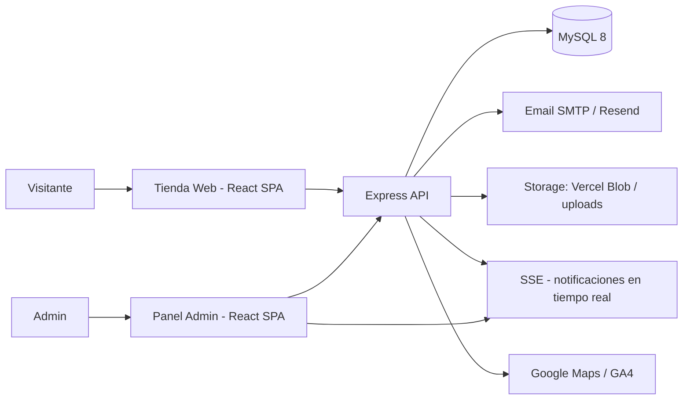

# Arquitectura

Cómo está organizado Maison Rosas a grandes rasgos.

- **Frontend:** dos SPAs (tienda pública y panel admin) construidas con Vite, servidas como estáticos por Express (o por el CDN de Vercel).
- **Backend:** API REST Express con capas de rutas → servicios → repositorios, y middleware de seguridad (headers, rate limit, validación, auth por token).
- **Base de datos:** MySQL 8, esquema aplicado automáticamente en el primer arranque de Docker o vía `npm run db:migrate`.
- **Autenticación:** sesiones de admin con token en BD, contraseñas con bcrypt, ruta secreta + filtros opcionales de IP/MAC.
- **Tiempo real:** SSE para notificaciones de pedidos nuevos y panel de cocina.
- **Despliegue:** `docker compose up` para producción autogestionada, o Vercel (estáticos + `api/index.ts` serverless).